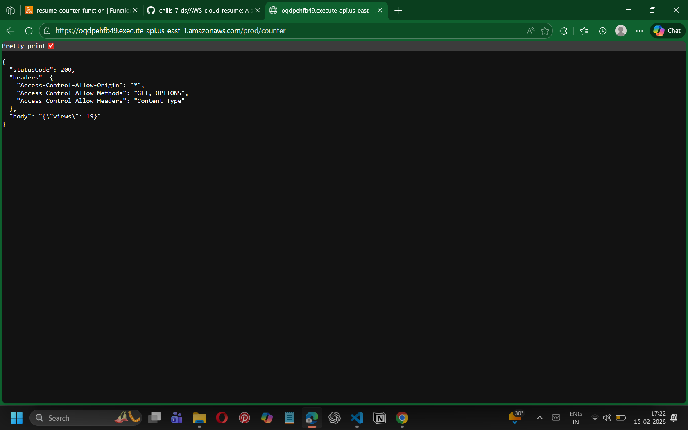
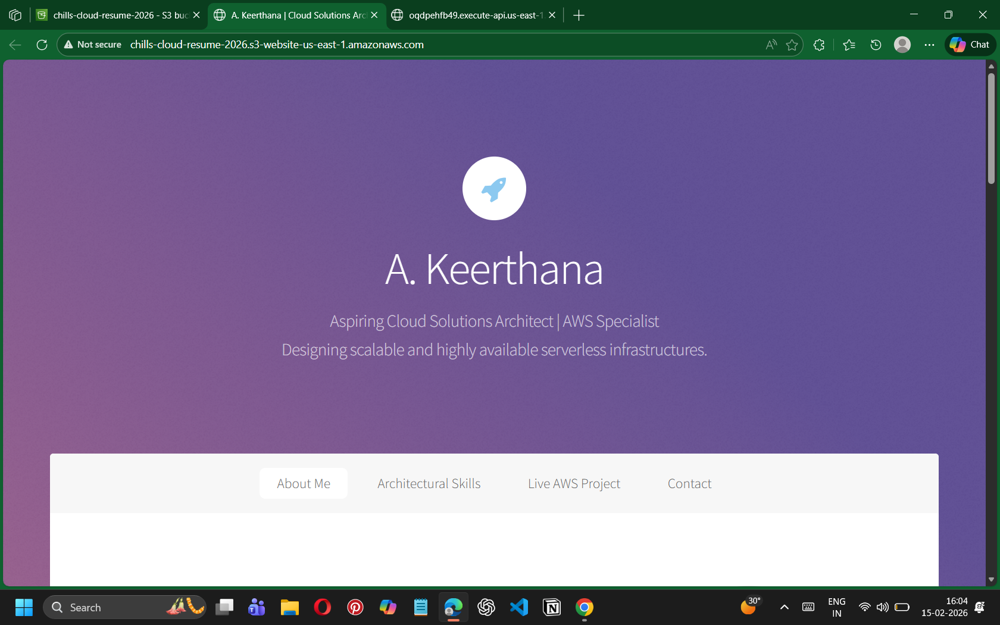

# ☁️ AWS Serverless Cloud Portfolio
A fully functional, event-driven portfolio website built on **Amazon Web Services (AWS)**. This project demonstrates a decoupled, serverless architecture designed for high availability and cost-efficiency.

## 🔗 [Live Portfolio Link](http://chills-cloud-resume-2026.s3-website-us-east-1.amazonaws.com)

---

## 🏗️ Architecture Overview
The project follows a "Serverless" pattern, ensuring no servers are managed and scaling is handled automatically by AWS:
- **Storage**: **Amazon S3** (Static Website Hosting).
- **Compute**: **AWS Lambda** (Python/Boto3) to handle backend logic.
- **Database**: **Amazon DynamoDB** (NoSQL) for visitor tracking.
- **API Management**: **Amazon API Gateway** (REST API) as the secure bridge.
- **Security**: **IAM** Least Privilege Policies and **CORS** configuration.

---

## 🛠️ The Technical Journey

### 1. Handling Access Control (S3)
During the initial deployment, I successfully resolved a **403 Forbidden Access** error by implementing a custom JSON Bucket Policy to enable public read access.

### 2. Database Initialization (DynamoDB)
I configured a NoSQL table to maintain state for the visitor counter. This screenshot verifies the initial item creation and data persistence.

### 3. API Integration & JSON Parsing
I built a RESTful API to trigger the Lambda function. This verifies the API returns a structured JSON response to the frontend.

### 4. Polished Frontend Design
The final portfolio is a responsive design that clearly communicates my skills and architectural mindset as an Aspiring Cloud Solutions Architect.

### 5. Live Visitor Counter Success
The "Grand Finale" — a real-time visitor counter that successfully bridges the S3 frontend to the DynamoDB backend.

---

## 🧠 Core Competencies Demonstrated
- **Cloud Security**: Configuring IAM roles and overcoming CORS (Cross-Origin Resource Sharing) challenges.
- **Backend Development**: Writing Python scripts with the **Boto3** library for AWS automation.
- **System Design**: Building a decoupled architecture where the frontend and backend operate independently.

---
**Author:** A. Keerthana  
**Role:** Aspiring Cloud Solutions Architect  
**Connect with me:** [LinkedIn](https://www.linkedin.com) | [GitHub](https://github.com)
